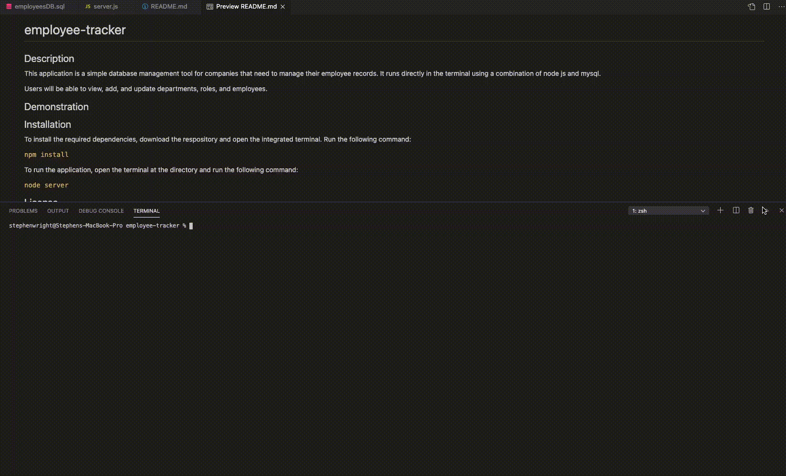

# employee-tracker

## Description 

This application is a simple database management tool for companies that need to manage their employee records. It runs directly in the terminal using a combination of node js and mysql. 

Users will be able to view, add, and update departments, roles, and employees. 

## Demonstration

##### For some reason, this gif takes a while to load. 

## Installation 

To install the required dependencies, download the respository and open the integrated terminal. Run the following command: 

`npm install`

To run the application, open the terminal at the directory and run the following command: 

`node server`

## License

This application uses the following license: [MIT License](License)

## Contact 

To contribute, please contact me directly at wrightsah@icloud.com. 

